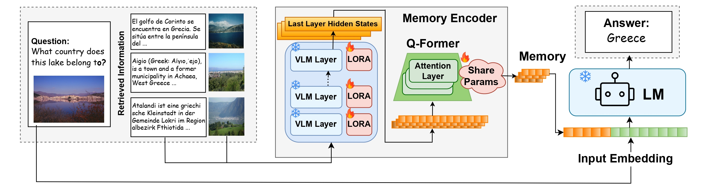
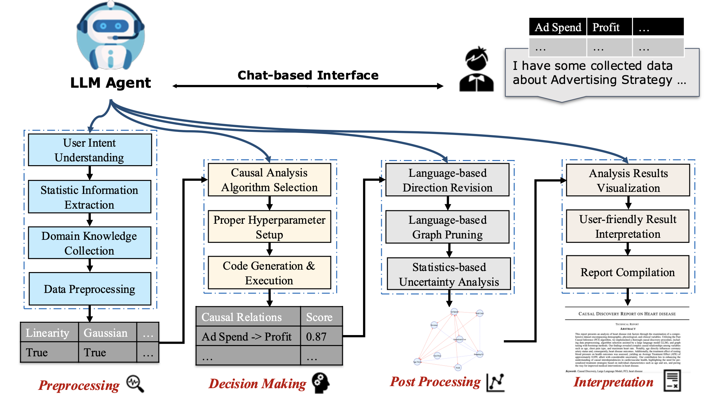

I am a Master student at [UC San Diego Halıcıoğlu Data Science Institute](https://datascience.ucsd.edu/), working in Professor Biwei Huang's Causal Intellligence Lab. My research interests are in Agentic AI and Causality, focusing on leveraging the power of Causality to make smarter and more reliable agentic AI.
Before joining UCSD, I obtained my Bachelor of Science in Statistics from The Chinese University of Hong Kong. Currently, I am actively looking for Ph.D. oppotunities in the Causality and Language Model field.

Education
------
- M.S. in Data Science, UC San Diego, 2024-2026 (*expected*)
- B.S. in Statistics (*First Class Honor*), CUHK, 2020-2024 
  - Department of Statistics Scholarship (2023)
  - University Admission Scholarship (2020)

---

## Research
My current research focuses on building unified, scalable, and self-evolving latent memory systems for large language models (LLMs) and multimodal agents. Inspired by human cognition, we aim to develop memory-augmented agents capable of reasoning, planning, and adapting across diverse tasks and modalities—more like the way humans think.

### 🧩 Research Interests
- **Latent Memory for Language Models**:
Train latent memory encoders that align with the internal representation space of LMs, enabling plug-and-play memory reuse across tasks and languages.

- **Memory-Augmented GUI Agents**:
Embed episodic experience from GUI environments into dense memory slots, allowing agents to solve complex tasks with fewer attempts and better generalization.

- **Unified Agentic Framework**:
Develop a foundation that supports GUI-based agents, general multimodal control planners (MCPs), etc. with shared memory and training infrastructure.

### 📝 Publications & Submissions

- **[Towards General Continuous Memory for Vision-Language Models](https://arxiv.org/pdf/2505.17670)**  
  *Wenyi Wu\*, Zixuan Song\*, Kun Zhou, Yifei Shao, Zhiting Hu, Biwei Huang*  
  **NeurIPS 2025 (🎉 accepted)**  
  We propose **CoMEM**, a plug-and-play continuous memory module for VLMs that encodes multimodal and multilingual knowledge into compact embeddings. It enables efficient knowledge reuse with minimal fine-tuning and significantly improves performance on visual reasoning tasks.  
  [[📄 Paper]](https://arxiv.org/pdf/2505.17670)  [[💻 Code]](https://github.com/WenyiWU0111/CoMEM)  

  

<em>Architecture of CoMEM for vision-language reasoning tasks.</em>

- **Auto-scaling Continuous Memory For GUI Agent**  
  *Wenyi Wu, Kun Zhou, Ruoxin Yuan, Vivian Yu, Stephen Wang, Zhiting Hu, Biwei Huang*
  **Under review at ICLR 2026**  
  We introduce a **continuous memory** framework for GUI agents, along with an **auto-scaling data flywheel** that autonomously discovers environments, generates tasks, collects trajectories, and performs quality evaluation. Our method achieves state-of-the-art results across multiple real-world GUI benchmarks.
.png "Architecture of CoMEM for vision-language reasoning tasks.")  

<em>Figure: Unified GUI agent system with continuous memory and auto-scaling flywheel.</em>

- **[Causal-Copilot: An Autonomous Causal Analysis Agent](https://arxiv.org/pdf/2504.13263)**  
  *Xinyue Wang\*, Kun Zhou\*, Wenyi Wu\*, Har Simrat Singh, Fang Nan, Songyao Jin, Aryan Philip, Saloni Patnaik, Hou Zhu, Shivam Singh, Parjanya Prashant, Qian Shen, Biwei Huang*  
  **Causal-Copilot** is an LLM-guided causal analysis system that automates the end-to-end causal analysis pipeline—from algorithm selection to PDF report generation—via natural dialogue. It empowers researchers to conduct rigorous causal analysis without requiring deep technical knowledge, outperforming traditional methods on both simulated and real-world datasets.  
  [[📄 Paper]](https://arxiv.org/pdf/2504.13263) [[💻 Code]](https://github.com/Lancelot39/Causal-Copilot) [[🔍 Demo]](https://causalcopilot.com/) [[💿 Video]](https://www.youtube.com/watch?v=A6j80I97Slg)
    
  
<em>Figure: Modular architecture of the Causal-Copilot system.</em>
  
---

Experiences
------

📖**Winter 2024 HDSI Causal Intellligence Lab, San Diego: Research Assistant**
-  Develop [Causal-Copilot](https://github.com/Lancelot39/Causal-Copilot), an LLM-oriented toolkit for Automatic Causal Analysis.
- Discover LLM Integrated Causal Discovery Algorithms.

💻**Summer 2024 Tencent Holdings Limited, Shenzhen: Data Scientist Intern**  
- Responsible for User Growth data science work in IEG group, conducted qualitative and quantitative data analysis to investigate differentiated strategies among users.

💻**Summer 2023 ByteDance Technology Limited, Beijing: Data Scientist Intern**
- Conducted Causal Inference and Machine Learning Modeling with statistical methods to analyze video and live stream data to improve business monetization.

💻**Spring 2023 HSBC Insurance (Asia) Limited, Hong Kong: Data Analyst Intern**
- Analyzed users data of HSBC Mobile APP *Well+* to improve user experience.

📖**Spring 2022 Statistics Department CUHK, Hong Kong: Research Assistant**
- Helped to develop the [Dnn-inference software](https://github.com/statmlben/dnn-inference), which is a significance analysis tool implemented with hypothesis testing theory to analyze the significance of features.

Open-Source Projects
------
I have a great passion for developing Data Science related projects and convert academic theories into applications.

- ⭐️[**Causal-Copilot**](https://github.com/Lancelot39/Causal-Copilot)
  - Causal-Copilot is an LLM-oriented toolkit for Automatic Causal Analysis. Designed for scientific researchers and data scientists, it facilitates the identification, analysis, and interpretation of causal relationships within real-world datasets through natural dialogue.
  - If you are interested in it, please try our [demo](https://huggingface.co/spaces/Causal-Copilot/Causal-Copilot) here.

- ⭐️[**CEM-LinearInf**](https://github.com/WenyiWU0111/CEM_LinearInf)
  - CEM-LinearInf is a Python package for linear causal inference, which can help you implement the whole process of causal inference easily.
  - If you are interested in it, please check the [documentation](https://cem-linearinf.readthedocs.io/en/latest/) here.

- ⭐️[**dnn-inference**](https://github.com/statmlben/dnn-inference)
  - dnn_inference is a Python module for hypothesis testing based on black-box models, including deep neural networks.
  - If you are interested in it, please check the [documentation](https://dnn-inference.readthedocs.io) here.

